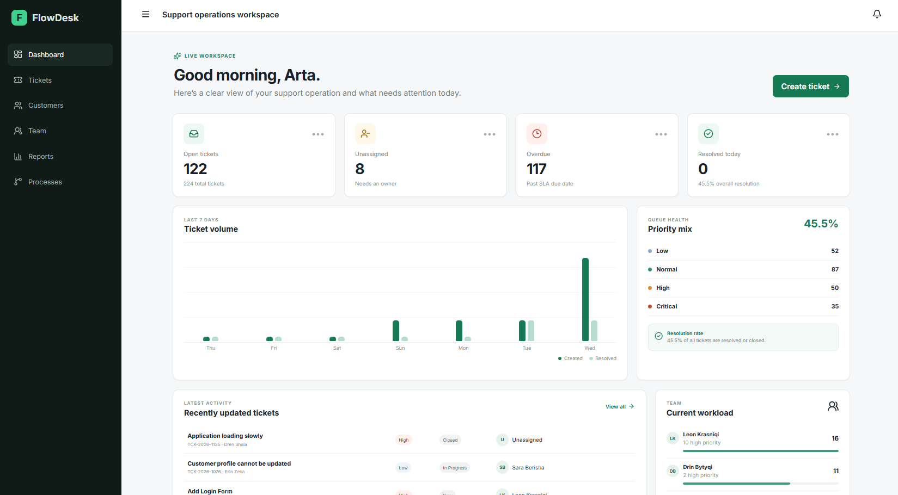
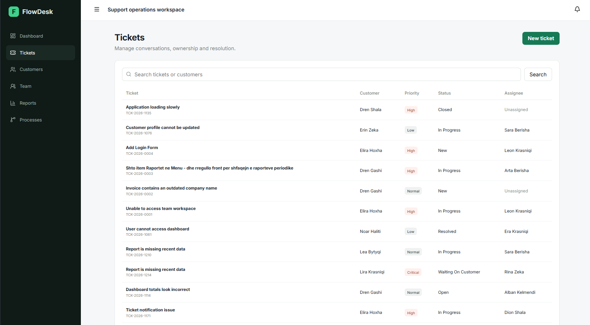
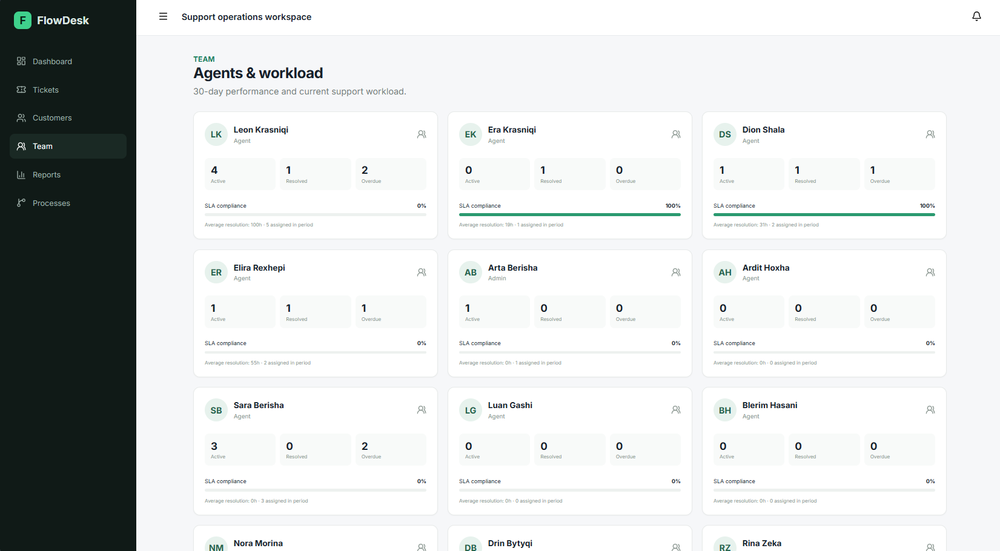
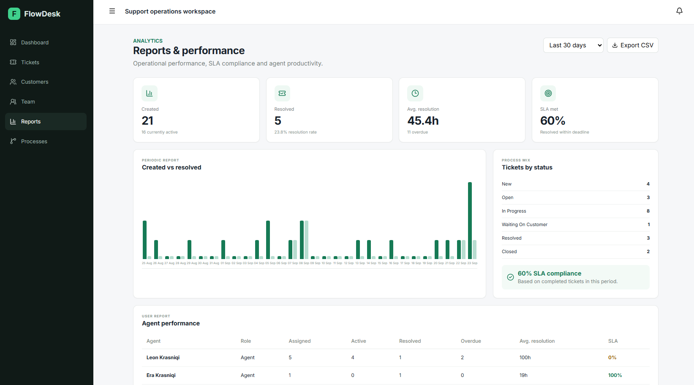
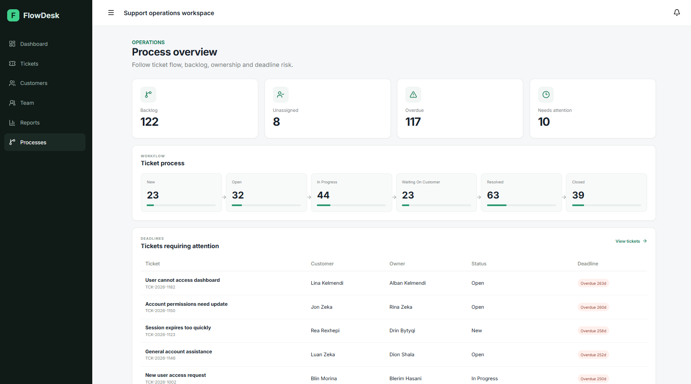

# FlowDesk

FlowDesk is a full-stack support ticket management application built with React, ASP.NET Core and SQL Server.

It helps support teams manage customer requests, assign tickets, track deadlines and monitor team performance.

## Screenshots

## Features

- Create and manage support tickets
- Assign tickets to team members
- Track ticket status and deadlines
- Manage customers
- Add comments and internal notes
- View ticket activity history
- Monitor team workload and performance
- View reports and support metrics
- Export report data to CSV
- User authentication

## Tech Stack

- React
- TypeScript
- ASP.NET Core
- C#
- Entity Framework Core
- SQL Server
- JWT Authentication

## Running locally

Make sure you have .NET 10, SQL Server, Node.js and npm installed.

Update the database connection string in:

`backend/FlowDesk.Api/appsettings.json`

Then run `FlowDesk.Api` from Visual Studio.

The database and demo data are created automatically when the application runs for the first time.

### Demo Login

Email: `admin@flowdesk.dev`  
Password: `Demo123!`
